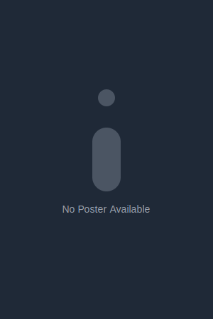

# 🎬 CineCritic - Movie Reviews Platform

<div align="center">


[](https://nextjs.org/)
[](https://www.typescriptlang.org/)
[](https://tailwindcss.com/)
[](https://firebase.google.com/)
[](LICENSE)

---

🌟 **Discover, Review, and Share Your Movie Experiences** 🌟

A modern, responsive movie reviews platform built with cutting-edge technologies

[✨ Live Demo](https://cinecritic.vercel.app/) | [📚 Documentation](#documentation) | [🚀 Get Started](#getting-started)

</div>

## ✨ Features

- 🎯 **Modern UI/UX**
  - Responsive design that works on all devices
  - Smooth animations and transitions
  - Dark mode optimized interface

- 🔍 **Advanced Search & Filtering**
  - Real-time search functionality
  - Filter by genres, languages, and ratings
  - Smart sorting options

- 👤 **User Management**
  - Secure authentication
  - Admin dashboard
  - User profiles and preferences

- 📱 **Progressive Features**
  - Mobile-first approach
  - SEO optimized
  - Fast loading times

## 🚀 Getting Started

### Prerequisites

- Node.js (v18 or higher)
- npm or yarn
- Firebase account

### Installation

1. **Clone the repository**
   ```bash
   git clone https://github.com/yourusername/movie-reviews-app.git
   cd movie-reviews-app
   ```

2. **Install dependencies**
   ```bash
   npm install
   # or
   yarn install
   ```

3. **Set up environment variables**
   ```bash
   cp .env.example .env.local
   ```
   Fill in your Firebase configuration details

4. **Start the development server**
   ```bash
   npm run dev
   # or
   yarn dev
   ```

Visit `http://localhost:3000` to see your app!

## 🏗 Project Structure

```
movie-reviews-app/
├── app/                  # Next.js 13 app directory
├── components/          # Reusable React components
├── context/            # React Context providers
├── lib/                # Utility functions and services
├── public/             # Static assets
└── types/              # TypeScript type definitions
```

## 💻 Tech Stack

- **Frontend Framework**: Next.js 13 with App Router
- **Styling**: Tailwind CSS with custom animations
- **State Management**: React Context
- **Database**: Firebase Firestore
- **Authentication**: Firebase Auth
- **Animations**: Framer Motion
- **Icons**: Lucide React

## 🎨 Features in Detail

### 🎬 Movie Management
- Add, edit, and delete movies
- Rich text descriptions
- Image upload and management
- Rating and review system

### 🔍 Search & Discovery
- Real-time search results
- Advanced filtering options
- Genre and language-based browsing
- Rating-based recommendations

### 👤 User Features
- Secure authentication
- Personal watchlists
- Review history
- Custom preferences

## 📱 Responsive Design

<div align="center">
<table>
<tr>
<td align="center">
📱 Mobile
</td>
<td align="center">
💻 Desktop
</td>
</tr>
<tr>
<td align="center">

</td>
<td align="center">

</td>
</tr>
</table>
</div>

## 🛠 Development

### Commands

- `npm run dev`: Start development server
- `npm run build`: Build for production
- `npm run start`: Start production server
- `npm run lint`: Run ESLint
- `npm run test`: Run tests

## 🤝 Contributing

1. Fork the repository
2. Create your feature branch (`git checkout -b feature/AmazingFeature`)
3. Commit your changes (`git commit -m 'Add some AmazingFeature'`)
4. Push to the branch (`git push origin feature/AmazingFeature`)
5. Open a Pull Request

## 📄 License

This project is licensed under the MIT License - see the [LICENSE](LICENSE) file for details.

## 🙏 Acknowledgments

- Next.js team for the amazing framework
- Tailwind CSS for the utility-first CSS framework
- Firebase for the backend services
- All contributors who helped with the project

---

<div align="center">

Made with ❤️ by [Lohith sai G]

⭐️ Star this project if you find it useful!

</div>
